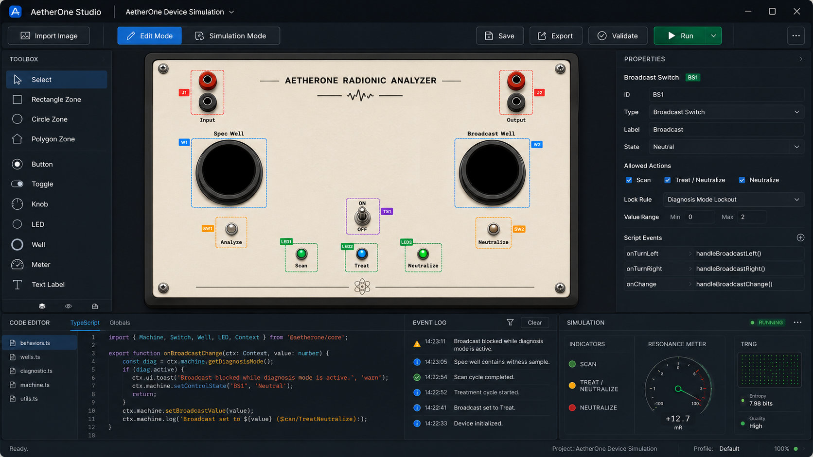

# AetherOne Studio

AetherOne Studio is a desktop application for creating and simulating interactive radionics-style devices from images.

The basic idea is simple: import an image of a device panel, mark its interactive elements (buttons, switches, knobs, wells, LEDs, sliders, meters, and other interface elements), define their behavior, then switch from edit mode into simulation mode and operate the device as if it were a functional instrument. Finally export the finished instrument as a reusable device file. The same device can later be opened by another user and operated in simulation mode.



Disclaimer: The project is intended for experimental, symbolic, educational, and simulation use. It is not a medical device and does not provide diagnosis or treatment.

## Main Goals

* Import an image of a radionics-style device panel
* Mark interactive regions directly on the image
* Define element types such as buttons, switches, knobs, wells, LEDs, meters, and output fields
* Add custom behavior through TypeScript or JavaScript
* Switch between edit mode and simulation mode
* Save and export complete virtual devices
* Load exported devices created by other users
* Support simulated output such as sound, graphics, logs, resonance events, and realtime feedback
* Later: connect external entropy or TRNG sources, for example ESP32-based hardware

## Technology Choice

The planned core stack is:

* **Tauri** for the desktop application shell
* **Angular** for the user interface
* **TypeScript** as the main application language
* **Konva.js** for canvas-based image annotation and interaction layers
* **Monaco Editor** for embedded TypeScript/JavaScript behavior editing
* **XState** for device logic and state machines
* **Web Audio API** for generated sound and audio feedback
* **Rust backend** through Tauri for filesystem access, export/import, and later serial communication
* **Optional ESP32 serial integration** for external TRNG input in later versions

This stack keeps the application flexible. The frontend can behave like a visual editor, while the backend can handle native functions such as file access, hardware communication, and packaged export.

## Planned Modes

### Edit Mode

In edit mode the user creates or modifies a virtual device.

Planned functions:

* Import background image
* Resize and position image
* Lock background layer
* Draw interaction zones
* Assign element types
* Name each element
* Set labels and metadata
* Configure visual states
* Set value ranges for knobs or sliders
* Define wells and their content rules
* Mark LEDs and output indicators
* Attach behavior scripts
* Validate the device before simulation

Example elements:

* Button
* Toggle switch
* Rotary knob
* Slider
* LED
* Meter
* Input well
* Output well
* Specimen well
* Broadcast well
* Text display
* Image overlay
* Resonance indicator

### Simulation Mode

In simulation mode the marked elements become active.

Planned functions:

* Click buttons
* Flip switches
* Turn knobs
* Place or remove virtual content from wells
* Trigger scan, diagnosis, broadcast, neutralize, or custom operations
* Display LEDs and visual feedback
* Generate sound
* Show logs and event history
* Display live graphs
* Block invalid operations according to device logic

Example rules:

* Do not broadcast while diagnosis mode is active
* Do not switch off while a well still contains an item
* Do not neutralize unless a broadcast session is active or completed
* Do not allow certain knobs to move while the device is locked
* Require a witness/specimen before scan can start
* Require a target or intention field before broadcast can begin

## Device Logic

Device behavior should be controlled by a state-machine core.

Example states:

* `off`
* `idle`
* `diagnosis`
* `scanning`
* `broadcasting`
* `neutralizing`
* `blocked`
* `error`

Scripts should not directly control everything. They should request actions through a controlled device API.

Example:

```ts
device.on("broadcast.request", ctx => {
  if (device.state.mode === "diagnosis") {
    return device.reject("Broadcast is blocked while diagnosis mode is active.");
  }

  if (!device.wells.spec.hasContent) {
    return device.reject("A witness is required before broadcast.");
  }

  device.startBroadcast({
    durationSeconds: 180,
    feedback: "resonance"
  });
});
```

This keeps the device safe, predictable, and easier to debug.

## Scripting Model

AetherOne Studio should provide a small controlled scripting API.

The script should be able to:

* Read element states
* Change LED states
* Change labels or displays
* Start or stop operations
* React to button, switch, knob, or well events
* Generate logs
* Trigger sound or visual feedback
* Read simulated or external entropy input
* Reject invalid actions with a visible message

The script should not have unrestricted access to the filesystem, DOM, network, or operating system.

For exported devices, scripts should be treated as untrusted code and executed inside a restricted sandbox.

## Proposed Device File Format

A finished device can be exported as a single file, for example:

```text
my-device.aetherdevice
```

Internally this file can be a ZIP archive.

Possible structure:

```text
manifest.json
background.png
elements.json
behavior.ts
behavior.js
assets/
  sounds/
  overlays/
  icons/
```

### manifest.json

Contains basic metadata.

```json
{
  "name": "Anapathic Machine Simulation",
  "author": "Unknown",
  "version": "0.1.0",
  "formatVersion": 1,
  "description": "Virtual simulation of a radionics-style dashboard."
}
```

### elements.json

Contains all marked interactive areas.

```json
{
  "elements": [
    {
      "id": "mainPower",
      "type": "toggle",
      "label": "ON/OFF",
      "hitArea": {
        "shape": "rect",
        "x": 780,
        "y": 610,
        "w": 48,
        "h": 90
      },
      "states": ["off", "on"],
      "initial": "off"
    },
    {
      "id": "specWell",
      "type": "well",
      "label": "Spec Well",
      "hitArea": {
        "shape": "circle",
        "x": 340,
        "y": 420,
        "radius": 95
      },
      "acceptsContent": true
    }
  ]
}
```

## TRNG and Hardware Integration

The first version should use a simulated entropy source.

Later versions can support external TRNG input from an ESP32 device over serial.

Possible future TRNG data sources:

* Simulated random stream
* ESP32 serial stream
* Webcam-based entropy source
* Audio noise source
* Hardware random generator
* Network-disabled local entropy input

The TRNG layer should be abstracted.

The simulator should not care where the entropy comes from. It should only receive normalized events such as:

```json
{
  "timestamp": 1730000000000,
  "source": "esp32",
  "value": 8123,
  "zScore": 2.4,
  "event": "minor_anomaly"
}
```

## Realtime Feedback

Broadcasting or scanning can produce visual and audio output.

Planned feedback types:

* LED changes
* Resonance meter
* Scrolling graph
* Event log
* Audio tone
* Pulsing overlay
* Symbolic field animation
* TRNG anomaly indicator
* Session summary

Example event types:

* `scan_started`
* `scan_completed`
* `broadcast_started`
* `broadcast_blocked`
* `broadcast_completed`
* `resonance_minor`
* `resonance_major`
* `resonance_peak`
* `neutralize_started`
* `neutralize_completed`

## Performance Strategy

The application should remain lightweight.

Planned rendering approach:

* One locked background image layer
* One editable shape layer for marked regions
* One simulation overlay layer
* Simple hit zones for interaction
* No unnecessary Angular change detection during realtime feedback
* Canvas updates only when needed
* TRNG parsing outside the main UI loop
* Logs and charts updated in controlled intervals

This should be sufficient for typical device panels with dozens or hundreds of elements.

## Planned Development Phases

### Phase 1: Basic Editor

* Create Tauri + Angular project
* Add image import
* Add Konva canvas
* Display background image
* Draw rectangles, circles, and polygons
* Select, move, resize, and delete regions
* Save and load project JSON

### Phase 2: Element System

* Add element types
* Add property editor
* Add element IDs and labels
* Add hit testing
* Add visual handles
* Add validation

### Phase 3: Simulation Mode

* Switch between edit and simulation mode
* Click buttons and switches
* Turn knobs
* Add simple wells
* Add LEDs
* Add state engine
* Add rule blocking

### Phase 4: Scripting

* Add Monaco Editor
* Define device scripting API
* Compile or run TypeScript/JavaScript behavior
* Connect scripts to element events
* Add error reporting
* Add sandboxing strategy

### Phase 5: Export and Import

* Define `.aetherdevice` format
* Export device package
* Import device package
* Include background image, elements, metadata, scripts, and assets
* Add device preview

### Phase 6: Feedback Engine

* Add Web Audio output
* Add graphs
* Add resonance indicators
* Add event logs
* Add session history
* Add simulated entropy source

### Phase 7: ESP32/TRNG Integration

* Add serial communication backend
* Read ESP32 entropy stream
* Normalize TRNG data
* Feed data into simulation engine
* Add anomaly detection
* Add realtime resonance feedback

## Development Status

Phase 1 implementation has started with a dependency-free browser prototype.

Open `index.html` in a browser to try the first editor slice:

* Default prototype image loading
* Image import
* Rectangle, circle, and polygon interaction zones
* Region selection and dragging
* Resize handles for rectangles, circles, and polygon vertices
* Element ID, label, and type editing
* Canvas fit, zoom in, zoom out, and 100% controls
* Basic validation for missing regions, duplicate IDs, empty labels, and tiny hit areas
* Basic edit/simulation mode switch
* Simulation session panel with reset and event history
* Element-specific simulation behavior for buttons, toggles, knobs, sliders, wells, LEDs, meters, displays, and resonance indicators
* Project JSON import and export

The intended production stack remains Tauri + Angular + TypeScript + Konva.js. This initial prototype keeps the UX and data model moving while the desktop scaffold is prepared.

## Disclaimer

AetherOne Studio is a simulation and experimental software project.

It is not intended to diagnose, treat, cure, or prevent disease. Any radionics-style terminology used in the application is part of the simulation model and symbolic interface design.
